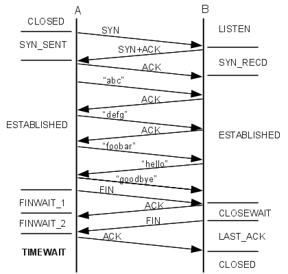

# TCP参数优化

**TCP连接和断开示意图：**

### backlog

### nodelay

### tcp_tw_reus: boolean

默认值是0

该参数用与配置是否快速回收处于**TIME_WAIT**状态的socket。

在默认情况下，TIME_WAIT状态会等待2ML市场来

该文件表示是否允许重新应用处于TIME-WAIT状态的socket用于新的TCP连接(这个对快速重启动某些服务,而启动后提示端口已经被使用的情形非常有帮助)

## 参考资料

* http://intronetworks.cs.luc.edu/current/html/
* http://intronetworks.cs.luc.edu/1/html/tcp.html
* http://blog.csdn.net/bytxl/article/details/46437363