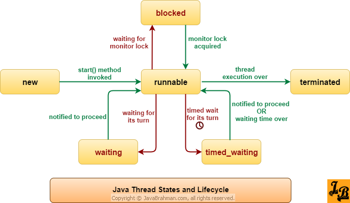

# Java线程生命周期

Thread.State里规定了Java线程的6个线程状态，分别为：

* Thread.State.NEW
* Thread.State.RUNNABLE
* Thread.State.BLOCKED
* Thread.State.WAITING
* Thread.State.TIMED_WAITING
* Thread.State.BLOCKED

> 需要注意是是，Java线程中没有Running状态。不同的编程语言对线程的操作粒度不一样，规定的线程状态也不一样。例如C#=就高达10种线程状态，分别为：Aborted、AbortRequested、Background、Running、Stopped、StopRequested、Suspended、SuspendRequested、Unstarted和WaitSleepJoin。

Java线程不同状态之间的转换如下：

## Java线程状态

- **New**：创建了线程对象，但还没调用`start()`方法之前的状态；
- **Runnable**：当`NEW`状态的线程调用`start()`方法后进入`Runnable`状态；
  - 线程进入`Runnable`状态不代表会被cpu立即执行，处于该状态的线程需要等待系统调度执行`run()`方法才真正处于运行时，但注意的是Java线程里并没有`Running`状态；
- **Blocked**：当线程需要等待锁释放时就会进入`Blocked`状态；
- **Waiting**：当线程需要让自己等待进一步信号（ go-ahead signal）来继续执行时，就会进入`Waiting`状态；有以下三种场景：
  - **线程调用`Object.wait()`进入`Waiting`状态**，其他的线程可以通过`Object.notify()`或`Object.notifyAll()`方法来唤醒处于`Waiting`状态的线程；
  - **当线程通过调用其他线程的`Thread.join()`方法时，自己本身会进入`Waiting`状态**：当join的线程执行完任务之后，会发送唤醒信号；
  - **Thread waiting due to LockSupport.park()method being invoked on it:** The waiting thread resumes when `LockSupport.unPark()` is called with the parked thread object as the parameter.
- **Timed_Waiting**：当线程收到特殊的指示让线程进入特定时间的等待状态时，线程会进入`Timed_Waiting`状态；有以下几种情况会进入`Timed_Waiting`状态：
  - 调用`Thread.sleep()`方法；
  - Threads being asked to wait for a permit for a specified amount of time using `LockSuport.parkNanos()` and `LockSupport.parkUntil()` methods.
  - 调用`Object.wait(long millis)`或`Thread.join(long millis, int manos)`方法；
- **Terminated**：当线程执行完`run()`方法后就会进入`Terminated`状态；

## 参考资料

* https://www.javabrahman.com/corejava/understanding-thread-life-cycle-thread-states-in-java-tutorial-with-examples/
* https://www.quora.com/What-is-the-lifecycle-of-thread-in-Java
* https://msdn.microsoft.com/en-us/library/system.threading.threadstate(v=vs.110).aspx